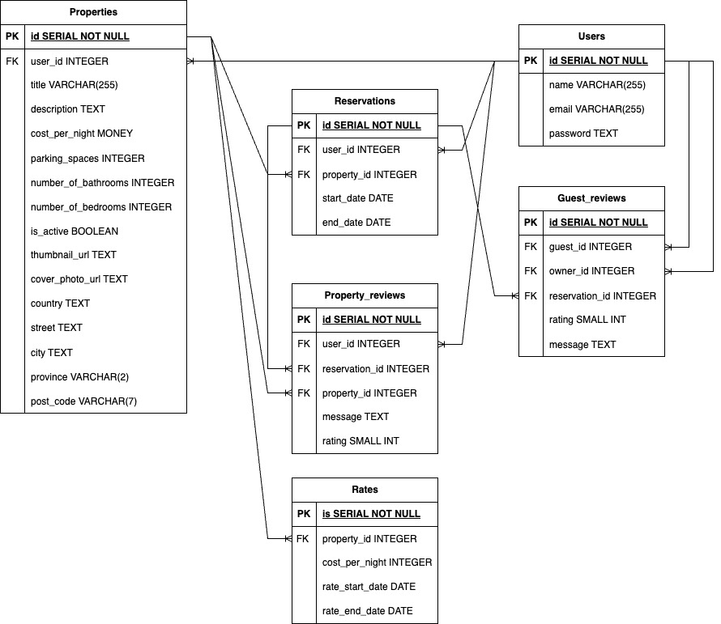
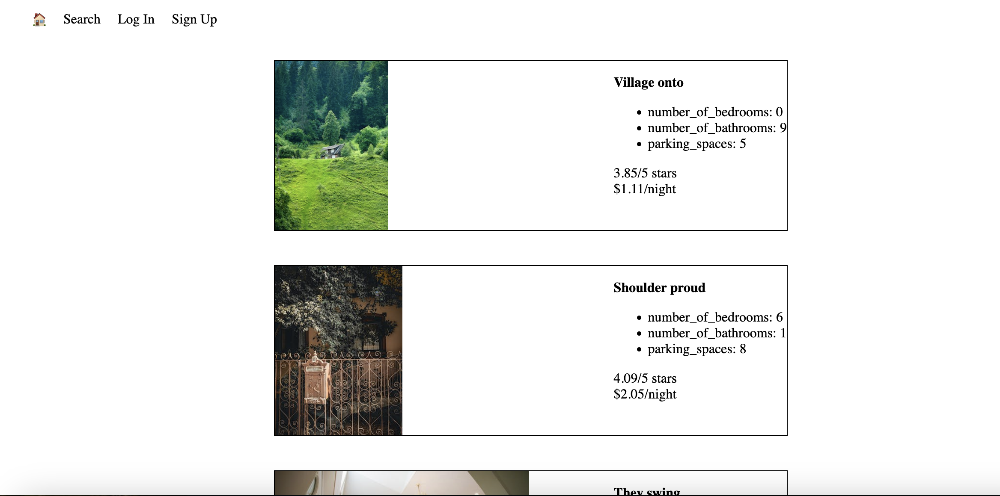
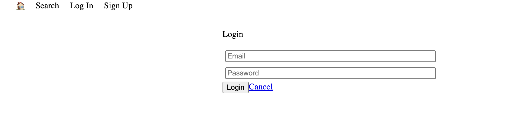
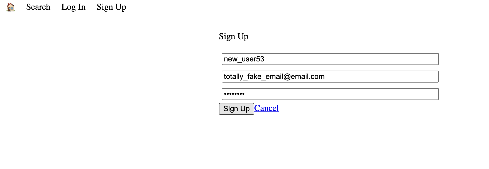
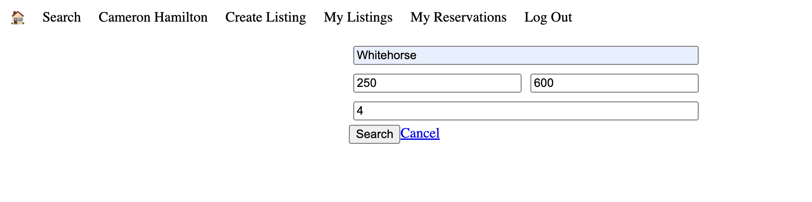
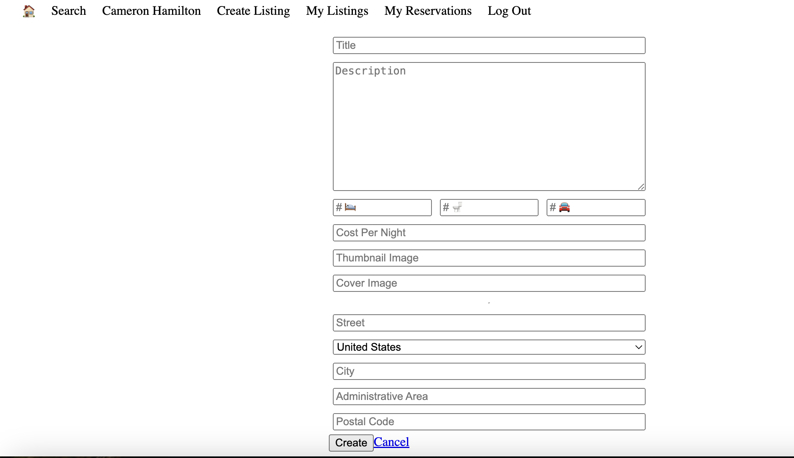
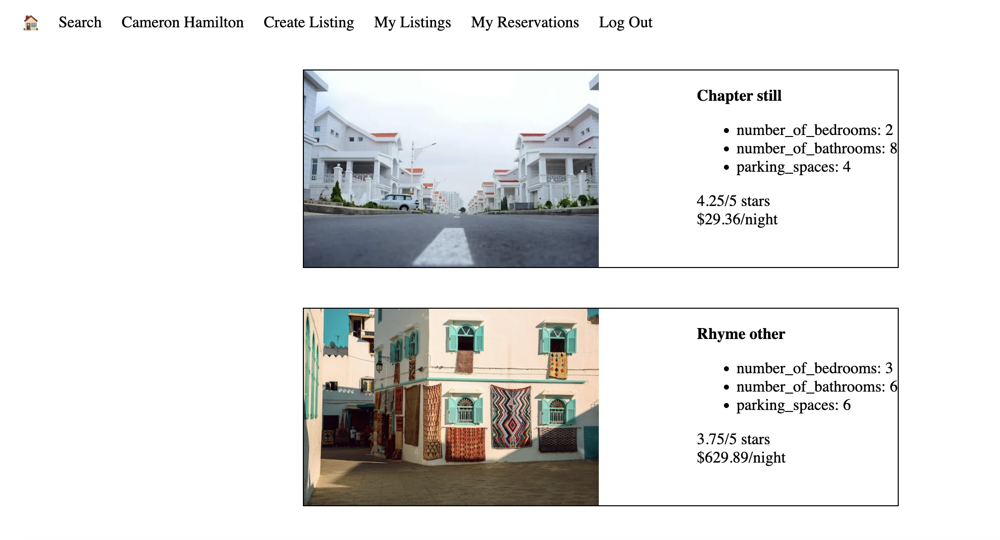
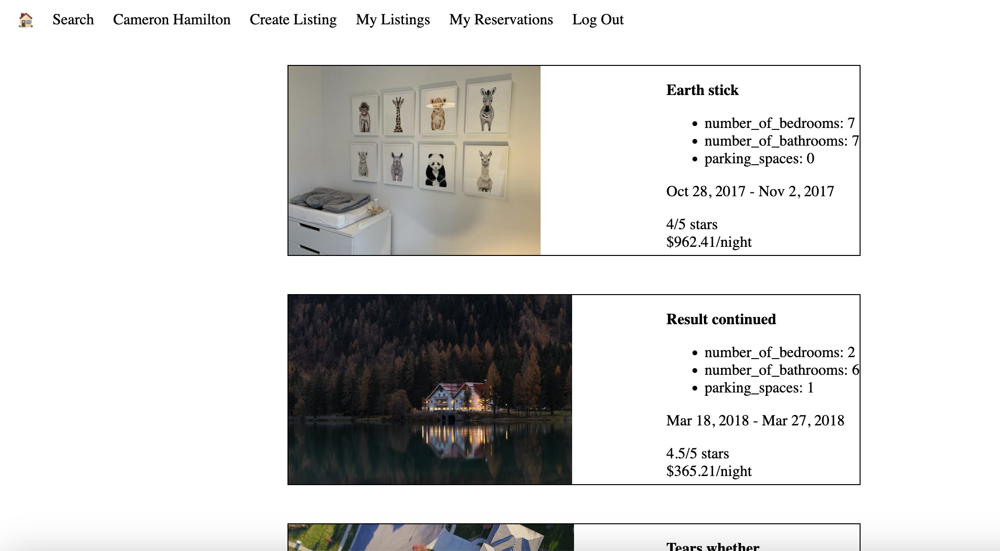

# Lighthouse BnB
Lighthouse BnB is an app that will revolutionize the travel industry. It will allow homeowners to rent out their homes to people on vacation, creating an alternative to hotels and bed and breakfasts...There’s nothing else like it! Users can view property information, book reservations, view their reservations, and write reviews. We'll be creating the first ever application to do something like this and we will call it LighthouseBnB.

## Getting Started
1. Navigate into the [LightBnB_WebApp-master](./LightBnB_WebApp-master) folder in your terminal
2. Install dependencies using the `npm install` command.
3. Start the web server using the `npm run local` command. The app will be served at <http://localhost:3000>.
4. Go to <http://localhost:3000> in your browser.

## Dependencies
- bcrypt
- cookie-session
- express
- nodemon
- pg

## Screenshots

> ERD for Lighthouse BNB

> Website landing page shows all properties

> Existing user's login form

> New user sign up form

> Filtered search form allows users to find the perfect listings

> Comprehensive form for owners to add new properties

> List of owned properties for the currently logged-in user

> List of all reservations for the currently logged-in user